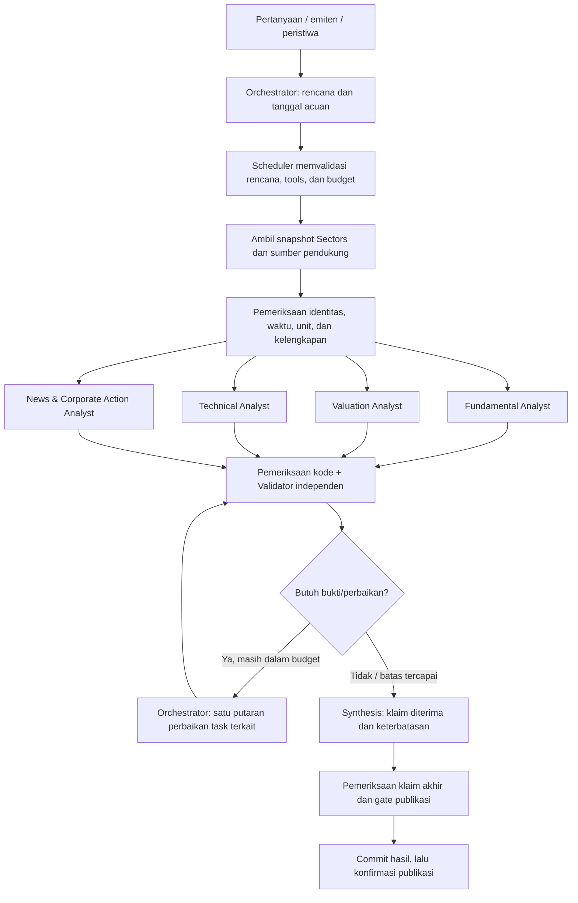

# SignalGate — keputusan arsitektur orkestrator

Tanggal: 17 September 2026.

**Revisi target perangkat:** pengguna menetapkan MacBook Pro M1 Pro, RAM unified 16 GB dan SSD
512 GB. [Profil Mac](PROFIL_MAC_M1_PRO.md) menjadi acuan pilihan model dan pelaksanaan peran di
bawah. Tabel workstation sebelumnya adalah alternatif, bukan default Mac. Orkestrator tetap ada;
node perhitungan/validasi mekanis dijalankan script, bukan wajib memanggil LLM.

Status: rancangan implementasi berdasarkan arahan pengguna. Orkestrator dipertahankan; fundamental,
valuation, technical, serta news/aksi korporasi menjadi empat dimensi wajib laporan. Pemilihan peran
dan model di bawah adalah keputusan awal rekayasa, belum hasil benchmark model dan belum diaktifkan
di aplikasi. Perubahan cakupan ini menggantikan pengecualian technical dalam draft v1 untuk arah
pengembangan berikutnya; tidak menyatakan implementasi runtime sudah berubah.

## 1. Peran agent

Tujuh peran logis berbagi model dan alat terstruktur. Peran dapat berupa node script, node LLM,
atau gabungan keduanya. Setiap peran memiliki schema keluaran dan jejak eksekusi. Jumlah peran
tidak berarti tujuh model harus dimuat atau tujuh panggilan LLM wajib dilakukan.

| Peran | Tanggung jawab | Keluaran | Pelaksana awal Mac |
|---|---|---|---|
| Orchestrator | Menafsirkan pertanyaan, menetapkan tanggal acuan, menyusun task, memilih tools yang diizinkan, menugaskan perbaikan | ResearchPlan dan task dengan dependensi/budget | LangGraph/Python; Qwen 7B hanya untuk perencanaan yang perlu interpretasi |
| Fundamental Analyst | Menjelaskan kondisi bisnis, pertumbuhan, profitabilitas, arus kas, dan risiko neraca sesuai karakter sektor | Temuan fundamental yang merujuk data periode tertentu | Metrik Python + interpretasi Qwen 7B |
| Valuation Analyst | Membandingkan rasio valuasi emiten dengan pembanding yang relevan dan menjelaskan asumsi/perbedaannya | Perbandingan valuasi, basis laba/ekuitas, sensitivitas dan keterbatasan | Perhitungan Python + interpretasi Qwen 7B; boleh berbagi panggilan dengan fundamental |
| Technical Analyst | Menjelaskan indikator harga/volume yang dihitung Python | Tren, momentum, volume, volatilitas, tanggal data dan keterbatasan | Python dan ringkasan template; konteks lintas dimensi oleh synthesis |
| News & Corporate Action Analyst | Menghubungkan berita ke emiten dan aksi yang tepat, membentuk kronologi, memisahkan fakta dan dugaan | Klaim berkutipan, event ID, kronologi dan konflik sumber | qwen2.5:7b Q4_K_M |
| Evidence & Consistency Validator | Memeriksa klaim seluruh dimensi terhadap sumber asli dan output perhitungan, termasuk kontradiksi | Status per klaim, alasan, bukti dan permintaan perbaikan terarah | Pemeriksaan Python + gemma3:4b, dengan uji kelayakan domain |
| Synthesis Agent | Menulis laporan dari klaim yang diterima dan keterbatasan yang harus ditampilkan | Laporan empat dimensi beserta bukti dan konflik yang belum selesai | qwen2.5:7b Q4_K_M |

`qwen2.5:14b` Q4_K_M menjadi mode analisis mendalam opsional, menggantikan model analis selama run
tersebut jika benchmark perangkat lulus. GLM 9B dan Gemma 12B tidak menjadi default Mac. Masalah
identitas dokumen, data hilang, dan angka salah diselesaikan dengan data/tools; persetujuan model
tambahan tidak boleh meloloskannya. Konflik yang belum selesai tetap `needs_review`.

Market/Sector Agent merupakan perluasan bersyarat: dipanggil bila pertanyaan atau bukti menunjukkan
eksposur sektor/komoditas yang relevan. Empat dimensi wajib tetap muncul meskipun bagian sektor
tidak memerlukan panggilan model tersendiri.

Pilihan Qwen memanfaatkan analis dan adapter JSON yang sudah dipakai proyek. Gemma menjadi pembaca
terpisah dari analis. Ini tidak mengklaim bahwa salah satu
model paling akurat untuk saham Indonesia. Evaluasi fixture dan holdout menentukan kelayakan serta
apakah reviewer tambahan memberi manfaat yang sepadan.

## 2. Workflow yang dipilih



Orchestrator memakai LLM untuk keputusan lingkup dan delegasi yang membutuhkan interpretasi.
Untuk tombol analisis emiten dengan alur tetap, rencana dibentuk script. LangGraph/Python
menegakkan dependensi, schema, allowlist tools, timeout, kredit, retry, dan state.
Rencana tidak boleh menghapus empat dimensi wajib. Jika bukti suatu dimensi kurang, task menulis
`insufficient_data` beserta sebab dan data yang diperlukan; dimensi tersebut tidak hilang dari UI.

Agent tidak saling membaca kesimpulan bebas secara otomatis. Mereka berbagi snapshot dan metrik
terverifikasi. Jika valuation membutuhkan metrik hasil normalisasi fundamental, dependensi itu
eksplisit di scheduler dan merujuk metrik, bukan menyalin narasi analis fundamental.

## 3. Sectors sebagai fondasi data

| Dimensi | Sumber utama | Implementasi proyek saat ini / pekerjaan tambahan |
|---|---|---|
| Fundamental | Company report dan quarterly financials | Klien dasar sudah ada; tambah normalisasi unit/periode dan paket metrik per sektor |
| Valuation | Bagian valuation, harga acuan, data peer/subsector yang sebanding | Klien report/subsector sudah ada; perlu pemilihan peer dan konsistensi basis rasio |
| Technical | Daily transaction data Sectors | `SectorsClient.daily()` sudah ada; perlu pengambilan histori, kontrak kualitas data, indikator dan hasil analisis |
| News/aksi | News Sectors, corporate-action metadata, dokumen resmi; artikel publik sebagai pendukung | Klien news dan scraper tersedia; perlu adapter corporate actions serta verifikasi hubungan event–dokumen |

Snapshot Sectors digunakan bersama agar empat agent tidak mengambil report identik berulang kali.
Setiap snapshot menyimpan parameter request, waktu ambil, waktu/periode data, hash, status sumber,
serta referensi ke field yang dipakai. Kredit dan retry sumber dicatat oleh scheduler.

Tanpa data Sectors yang diperlukan, laporan penuh berstatus parsial karena konteks perusahaan,
valuasi atau histori pasar tidak dapat diperiksa. Bukti publik yang tersedia tetap boleh ditampilkan
dengan lingkup yang jelas. Replay hanya menggunakan snapshot Sectors yang benar-benar pernah
diambil, dengan tanggalnya dinyatakan; tidak dipresentasikan sebagai data live.

Dokumentasi daily mencantumkan OHLCV pada contoh respons, batas 90 hari per request, dan biaya satu
kredit. Verifikasi field dan cakupan pada respons aktual sebelum memakai indikator. Rentang yang
lebih panjang diambil bertahap, diurutkan dan dideduplikasi berdasarkan simbol/tanggal.

## 4. Kontrak analisis tiap dimensi

### Fundamental

- Metrik dihitung kode dari data terstruktur; agent menjelaskan perubahan dan keterbatasannya.
- Bedakan periode kuartalan, kumulatif, tahunan dan TTM; jangan membandingkan basis berbeda.
- Rasio sektor keuangan tidak dipaksakan mengikuti perusahaan nonkeuangan.
- Data kosong bukan nol. Setiap angka memiliki unit, periode, sumber dan formula bila diturunkan.

### Valuation

- Agent terpisah karena pertanyaannya berbeda dari kesehatan bisnis: bagaimana penilaian pasar
  dibandingkan data bisnis dan pembanding yang dipilih?
- Tahap awal memakai analisis relatif PE/PB dan pembanding yang sesuai bila tersedia. Forward PE
  tidak dibandingkan langsung dengan trailing PE tanpa pengungkapan perbedaan basis.
- Laba/ekuitas nonpositif atau peer tidak memadai menghasilkan keterbatasan eksplisit.
- Python menghitung rasio/rentang skenario; LLM tidak mengarang target harga atau nilai wajar.
- Untuk submission: keluaran berupa analisis dan asumsi, tanpa keputusan buy/sell atau eksekusi.

### Technical — wajib dalam laporan

- Basis awal data harian: return, SMA20/SMA50, RSI14, MACD12/26/9, volume relatif dan volatilitas
  return. Formula, versi dan minimum observasi ditentukan di kode serta diuji dengan fixture acuan.
- Rencanakan minimal 120 sesi sebagai buffer awal; kelayakan setiap indikator tetap mengikuti
  kebutuhan observasi/warm-up, bukan sekadar panjang kalender. Histori pendek tetap dilaporkan.
- Periksa duplikasi, urutan tanggal, harga/volume invalid, data stale, hari tanpa transaksi, dan
  corporate actions. Jangan mengisi volume nol atau harga sebelumnya secara diam-diam.
- Basis penyesuaian harga harus diketahui. Bila perubahan harga tidak dapat dipisahkan dari stock
  split/rights issue, tahan kesimpulan lintas peristiwa tersebut sampai basis seri jelas.
- Agen menjelaskan hasil perhitungan; technical tidak memverifikasi keabsahan aksi korporasi.
- Bukan intraday/order-book analytics; data tersebut tidak diasumsikan tersedia dari endpoint daily.

### News dan aksi korporasi

- Simpan waktu publikasi dan pengambilan secara terpisah. Artikel lama yang diterbitkan ulang tidak
  otomatis menjadi kejadian baru.
- Kelompokkan berita salinan; jumlah artikel bukan jumlah konfirmasi independen.
- Hubungkan ticker, identitas aksi, nomor pengumuman, tanggal dan lampiran. Ticker/keyword saja
  tidak cukup untuk menetapkan hubungan.
- Bedakan fakta dokumen, pernyataan pihak terkait, interpretasi analis dan rumor.
- Ketidakjelasan dokumen tetap diteruskan ke validator dan laporan, meski model berhasil selesai.

## 5. Validasi dan batas iterasi

Validasi dilakukan terhadap klaim, bukan voting label antaragent.

1. **Validasi data/kode:** schema, ticker/event ID, unit, periode, tanggal acuan, kutipan dan hasil
   perhitungan. Pemeriksaan ini tidak bisa dibatalkan oleh persetujuan LLM.
2. **Pembacaan independen:** validator membaca paket sumber asli dan pertanyaan domain sebelum
   melihat kesimpulan analis, lalu hasilnya dibandingkan per klaim. Konteks besar dibagi per domain
   agar tidak menghilangkan bukti; satu peran validator boleh menjalankan beberapa task.
3. **Pemeriksaan konflik:** validator mengidentifikasi apakah dua pernyataan benar-benar bertentangan
   atau hanya berbeda periode/dimensi. Technical melemah dan fundamental membaik dapat sama-sama benar.
4. **Perbaikan terarah:** orchestrator mengambil bukti tambahan atau mengulang hanya task bermasalah.
   Maksimal satu putaran perbaikan untuk tiap kasus. Validasi ulang hanya mencakup klaim yang berubah
   dan klaim turunannya. Semua perubahan memiliki versi.
5. **Pemeriksaan laporan akhir:** setiap klaim naratif merujuk klaim diterima, angka tetap sama dengan
   sumber/perhitungan, keterbatasan tidak hilang. Claim ID valid saja belum membuktikan parafrasa
   benar; parafrasa material diperiksa terhadap klaim asli. Klaim baru kembali ke jalur validasi.

Jika batas tercapai, keluarkan laporan parsial atau `needs_review`; jangan mempromosikan draft yang
tidak pernah lolos menjadi hasil terverifikasi. Tidak ada skor probabilitas kebenaran tanpa kalibrasi.

## 6. Format hasil dan state

Kontrak minimum tiap hasil domain:

```text
run_id, task_id, case_id, ticker, domain, as_of
status: completed | insufficient_data | needs_review | failed
claims[]:
  claim_id, kind (observation | calculation | interpretation), statement
  source_ids[], source_locator (JSON path / halaman / kutipan)
  observed_at, period, unit, calculation_ref
  supports_claim_ids[], assumptions[], limitations[]
  validation_status (pending | supported | unsupported | contradicted)
metrics[], missing_data[], conflicts[]
model_tag, model_digest, prompt_version, schema_version
```

Setiap referensi sumber/perhitungan di-resolve ke artefak asli yang tersimpan; ID buatan model yang
tidak ditemukan ditolak. `as_of` membatasi bukti yang boleh dipakai. Tanggal laporan keuangan bukan
otomatis tanggal informasi tersedia kepada publik; availability yang tidak diketahui membatasi
klaim evaluasi historis.

Laporan berisi empat panel wajib, ringkasan lintas dimensi, bukti, konflik dan informasi yang kurang.
Label corporate-action screening lama dipertahankan sebagai dimensi tersendiri. Technical positif
tidak menghapus structural red flag dan tidak mengubahnya menjadi rekomendasi transaksi.

State task: pending → running → completed/insufficient_data/needs_review/failed. Progres tersimpan
per task sebelum operasi dimulai. SSE membawa snapshot/event yang dapat dipulihkan setelah refresh.
Hasil disimpan dengan versi dan kunci idempotensi; publikasi dikonfirmasi setelah commit untuk versi
hasil yang tepat. Retry tidak membawa marker publikasi hasil lama.

## 7. Eksekusi model dan biaya

- Target default: M1 Pro 16 GB, Qwen 7B Q4 dan reviewer Gemma 4B. Qwen 14B Q4 adalah mode opsional
  setelah pengukuran; ukuran file model bukan total penggunaan unified memory.
- Pengambilan sumber dan perhitungan CPU dapat berjalan paralel. Inferensi lokal awal dibatasi
  satu model aktif; konteks setiap peran tetap terpisah walaupun bobot model dipakai ulang.
- Urutan normal: rencana script → data/perhitungan → Qwen ekstraksi berita dan interpretasi bisnis
  → unload Qwen → Gemma memvalidasi → unload Gemma → Qwen menyusun laporan. Panggilan planner
  hanya untuk permintaan terbuka. Data technical tetap muncul meski node technical tidak memakai LLM.
- Rencana model tidak langsung mengeksekusi kode/URL bebas. Scheduler menjalankan tool bernama
  dari registry dengan parameter tervalidasi. Adapter structured JSON yang ada dapat diperluas.
- Jumlah task, panggilan model, retry, token, waktu dan kredit API dicatat. Budget awal ditentukan
  melalui satu kasus pilot; throughput tidak dijanjikan sebelum pengukuran.
- Profil workstation lama menjalankan GLM dan Gemma sebagai reviewer setiap kasus. Profil Mac,
  routing LangGraph dan pengurangan panggilan di atas membutuhkan implementasi; dokumen ini tidak
  otomatis mengubah `.env`, dependensi atau runtime aplikasi.

## 8. Pemetaan implementasi

1. **Kontrak dan scheduler:** perluas orchestration untuk ResearchPlan, empat task domain wajib,
   snapshot progres, versi hasil, dan batas perbaikan.
2. **Lapisan data:** perluas adapter Sectors, simpan snapshot bersama, tetapkan kontrak histori harga,
   data keuangan dan identitas news/aksi. Lakukan pemeriksaan respons aktual yang terarah.
3. **Perhitungan:** modul fundamental/valuation/technical deterministik dengan fixture numerik acuan.
4. **Agent spesialis:** prompt dan schema terpisah menggunakan adapter Ollama yang ada. Reuse
   ekstraksi bukti dan verifikasi kutipan yang sudah berjalan untuk news/aksi.
5. **Validator dan synthesis:** independent read, pemeriksaan klaim, satu putaran koreksi terarah,
   dan laporan empat dimensi tanpa menghapus ketidakpastian.
6. **API dan dashboard:** satu run berisi task domain dan statusnya; evidence link/halaman dan
   perbandingan antarperiode tersedia. Simpan laporan parsial dengan penjelasan yang dapat dibaca.

Perubahan aplikasi lain sedang ada di working tree saat rancangan dibuat. Implementasi harus
mereview keadaan terbaru sebelum mengubah modul yang sama. Temuan QA lama menjadi skenario
regresi, bukan asumsi bahwa bug tersebut masih ada setelah perubahan berjalan.

## 9. Kriteria penerimaan

- Satu emiten menghasilkan keempat dimensi atau alasan eksplisit mengapa data suatu dimensi kurang.
- Angka technical/valuation konsisten dengan perhitungan acuan; periode dan tanggal harga terlihat.
- Lampiran aksi salah dan kutipan tanpa sumber tertahan, sekalipun beberapa model menyetujuinya.
- Pertentangan antarperiode/dimensi dipertahankan dengan penjelasan, bukan dipaksa menjadi voting.
- Refresh saat tiap task berjalan memulihkan task aktif; kegagalan publikasi retry dapat dipulihkan
  tanpa menggandakan kartu atau memakai penanda publikasi versi sebelumnya.
- Tidak ada loop tak terbatas; model/sumber gagal menghasilkan status yang eksplisit.
- Bandingkan workflow ini dengan baseline analis tunggal pada snapshot sama: dukungan bukti,
  kesalahan numerik/identitas, coverage, abstention, biaya, waktu dan penilaian pengguna. Gunakan
  kasus holdout berlabel manusia dan jangan menganggap persetujuan model sebagai label acuan.

## 10. Referensi yang diperiksa

- [Sectors: Building Multi-Agent Workflows for Financial Research](https://docs.sectors.app/recipes/generative-ai-python/03-multiagent-workflows)
  memberi contoh peran spesialis, orkestrasi berurutan dan evaluator. Rancangan ini tidak menyalin
  fallback tutorial yang memakai draft terakhir ketika evaluasi belum lulus.
- [Sectors: Daily Transaction Data](https://docs.sectors.app/api-references/v2/indonesia/transaction/daily)
  untuk contoh OHLCV, batas rentang dan biaya request. Ketersediaan/semantik respons live belum diuji.
- [Sectors: Company Report](https://docs.sectors.app/api-references/v2/indonesia/report/company-report)
  dan [News Articles](https://docs.sectors.app/api-references/v2/indonesia/news/news).
- Tag model dikonfirmasi di katalog Ollama: [Qwen2.5 14B](https://ollama.com/library/qwen2.5:14b),
  [Gemma 3 12B](https://ollama.com/library/gemma3:12b), [GLM-4 9B](https://ollama.com/library/glm4:9b).
  Keberadaan tag tidak membuktikan kesiapan model di mesin lokal atau akurasi domain.
- [Aturan hackathon](https://hackathon.sectors.app/rules) dan
  [Track AI Agents & Assistants](https://hackathon.sectors.app/tracks/ai-agents-assistants).
