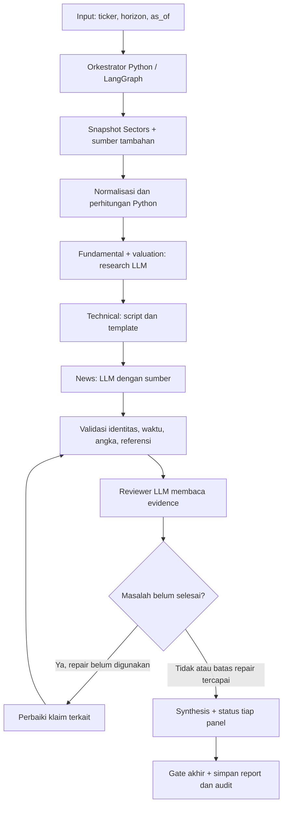

# Guideline membangun dan menjalankan workflow SignalGate

Target: MacBook Pro M1 Pro, RAM 16 GB, SSD 512 GB. Rancangan mempertahankan orkestrator serta empat panel: **fundamental, valuation, technical, news**.

## 1. Apa yang sudah bisa dijalankan?

| Bagian | Status |
|---|---|
| Backend/frontend SignalGate, adapter Sectors, ekstraksi dan reviewer Ollama | Sudah ada di repository |
| Contoh orkestrasi LangGraph, checkpoint, validasi dan satu repair | Bisa dijalankan melalui `docs/examples/workflow_demo.py` |
| Empat panel berbasis data nyata dalam satu graph | Rancangan implementasi; belum tersambung ke backend |
| Pengukuran kecepatan dan peak RAM model di Mac ini | Belum dilakukan |

Contoh graph memakai **data sintetis dan tidak memanggil LLM/API**. Kelulusannya membuktikan alur kontrol dan resume, bukan akurasi analisis saham. Tidak ada perubahan otomatis pada `.env` atau instalasi model dari dokumen ini.

## 2. Arsitektur yang dibangun



**Agent adalah peran, bukan satu model besar yang harus dimuat sendiri-sendiri.** Qwen yang sama dapat menjalankan tugas research, news, dan synthesis bergantian dengan prompt dan schema berbeda. Graph mengatur urutan, state, retry, dan batas proses. Jangan meminta LLM menentukan sendiri kapan boleh menerbitkan laporan.

Pengambilan data HTTP dapat paralel dengan batas koneksi/rate limit. Untuk awal, semua pekerjaan LLM dijalankan berurutan. LangGraph mendukung node berupa fungsi biasa maupun panggilan model; lihat [Graph API](https://docs.langchain.com/oss/python/langgraph/graph-api).

## 3. Pembagian pekerjaan dan model

| Pekerjaan | Pelaksana awal | Keluaran |
|---|---|---|
| Routing, budget, retry, checkpoint | Python/LangGraph | Execution plan dan status |
| Fetch, deduplikasi, tanggal, ticker, unit | Script | Snapshot dengan provenance |
| Growth, margin, leverage, rasio valuasi | Pandas/NumPy atau Python | Angka + formula + periode |
| Fundamental dan valuation | Qwen2.5 7B quantized | Interpretasi atas angka yang sudah dihitung |
| RSI, moving average, ATR, volume | Script indikator yang diuji | Nilai indikator, window dan harga basis |
| Panel technical awal | Template Python | Tren, momentum, volatilitas dan keterbatasan |
| News/corporate action | Qwen2.5 7B quantized | Event, tanggal, entitas, klaim bersumber |
| Pemeriksaan mekanis | Script | Pass/fail per klaim |
| Review makna dan kontradiksi | Gemma3 4B quantized, kandidat | Verdict beserta sumber pendukung/penyangkal |
| Synthesis | Qwen2.5 7B quantized | Penjelasan lintas panel |

Gemma adalah kandidat reviewer, bukan jaminan independensi atau akurasi. Benchmark terhadap kasus berlabel sebelum menganggap hasilnya valid. Model berbeda pun bisa membuat kesalahan yang sama.

Mulai dengan Qwen7B; gunakan Qwen14B hanya sebagai mode mendalam jika pengukuran menunjukkan manfaat. Ukuran paket Ollama sekitar 4,7 GB untuk [Qwen7B Q4_K_M](https://ollama.com/library/qwen2.5:7b) dan 9 GB untuk [Qwen14B Q4_K_M](https://ollama.com/library/qwen2.5:14b). Ukuran paket bukan penggunaan RAM puncak.

**Tidak perlu quantize ulang setiap mengubah prompt atau parameter inference.** Model Q4 yang diunduh sudah quantized. Quantization mengubah presisi bobot, bukan mengubah 14B menjadi 7B. Modelfile yang mengganti temperature/context tidak melakukan quantization baru; lihat [Ollama import](https://docs.ollama.com/import).

## 4. Setup SignalGate yang sudah ada

Jalankan dari root repository. Gunakan Python 3.11+ dan Node yang kompatibel dengan versi Vite pada lockfile. Gunakan runtime native Apple Silicon. Instal [Ollama](https://ollama.com/download/mac) jika belum ada.

```bash
cd /Users/yhnswp/Desktop/signalgate
python3 scripts/setup.py --profile laptop --skip-models
```

Script setup menyiapkan backend dan menjalankan tes; `--skip-models` menunda download model. `.env` yang sudah ada dipertahankan. **Edit nilai di `backend/.env`, jangan menimpa file berisi API key.** Untuk live Sectors dan profil Mac awal:

```dotenv
SECTORS_API_KEY=isi_key_milikmu
SECTORS_API_ENABLED=true
SIGNALGATE_PROFILE=laptop
LLM_BACKEND=ollama
OLLAMA_BASE_URL=http://127.0.0.1:11434
OLLAMA_MODEL=qwen2.5:7b
OLLAMA_REVIEWER_MODELS=["gemma3:4b"]
OLLAMA_OFFLOAD_BETWEEN_MODELS=true
OLLAMA_NUM_CTX=4096
RESEARCH_MAX_PAGES=3
RESEARCH_CONTEXT_CHARS=1000
RESEARCH_CONTEXT_TOTAL_CHARS=4000
RESEARCH_REVIEW_ROUNDS=1
RESEARCH_VALIDATOR_MODE=strict
PIPELINE_MAX_EVENTS=1
```

Hapus baris `OLLAMA_VALIDATOR_MODEL` bila memakai `OLLAMA_REVIEWER_MODELS`; konfigurasi sekarang menolak keduanya diisi bersamaan. `backend/.env.example` saat ini memuat context dan reviewer lebih berat, sehingga tetap perlu override di atas. Batas karakter adalah titik awal, bukan bukti prompt pasti muat: ukur token setelah schema dan instruksi dimasukkan.

Untuk eksperimen Ollama dengan satu model resident dan satu inference, **quit aplikasi Ollama terlebih dahulu** bila sedang berjalan, lalu gunakan terminal khusus:

```bash
OLLAMA_MAX_LOADED_MODELS=1 OLLAMA_NUM_PARALLEL=1 ollama serve
```

Jangan menjalankan dua server pada port yang sama. Alternatifnya tetap gunakan aplikasi Ollama dan atur environment aplikasi sesuai [FAQ Ollama](https://docs.ollama.com/faq). Environment di terminal lain tidak mengubah server aplikasi yang sudah berjalan.

Di terminal lain:

```bash
ollama pull qwen2.5:7b
ollama pull gemma3:4b
ollama show qwen2.5:7b
ollama show gemma3:4b
ollama list
```

Periksa quantization pada hasil `show`, dan simpan digest model pada hasil benchmark karena tag dapat berubah. Jangan langsung download 14B. Untuk memeriksa model resident ketika inference berjalan, gunakan `ollama ps`.

Backend, terminal terpisah:

```bash
cd /Users/yhnswp/Desktop/signalgate/backend
.venv/bin/uvicorn app.main:app --reload
```

Frontend, terminal terpisah:

```bash
cd /Users/yhnswp/Desktop/signalgate/frontend
npm ci
npm run dev
```

Buka alamat yang dicetak Vite dan backend `/docs` untuk kontrak API aktual. Endpoint `/pipeline/run` dan `/scan/run` adalah job asynchronous yang sudah ada; pantau status run. **Keduanya belum menjalankan graph empat panel dalam rancangan ini.**

Catatan: adapter Ollama sekarang mengirim `num_predict=2048` dari konstanta. Target output 1024 untuk graph baru harus menjadi konfigurasi adapter terlebih dahulu. Mengubah Modelfile saja tidak mengalahkan parameter eksplisit dalam request. Ketika context tidak cukup, kurangi batch atau retrieval, jangan memotong evidence tanpa mencatatnya.

## 5. Jalankan contoh LangGraph tanpa API key atau model

Gunakan virtual environment terpisah agar dependency prototipe tidak mengubah backend sekarang:

```bash
cd /Users/yhnswp/Desktop/signalgate
python3 -m venv /tmp/signalgate-workflow-venv
/tmp/signalgate-workflow-venv/bin/python -m pip install -r docs/examples/requirements-workflow.txt
/tmp/signalgate-workflow-venv/bin/python docs/examples/workflow_demo.py --run-id demo-001 --ticker TEST --output-dir /tmp/signalgate-workflow-demo
```

Keluaran yang diharapkan: `status: fixture_completed`, `repair_count: 1`, dan lokasi `demo-001.json`. Di direktori output ada `checkpoints.sqlite`. JSON berisi empat domain, seluruhnya berlabel `OFFLINE_FIXTURE`.

Demo sengaja menaruh referensi sumber yang salah pada news. Validator mendeteksinya, repair fixture memperbaikinya, lalu validasi diulang. Validasi contoh **hanya mengecek referensi**, belum membuktikan dukungan semantik sumber. Pada data nyata, repair wajib memeriksa isi sumber sebelum mengubah referensi.

Coba kegagalan dan resume:

```bash
/tmp/signalgate-workflow-venv/bin/python docs/examples/workflow_demo.py --run-id demo-fail --ticker TEST --output-dir /tmp/signalgate-workflow-demo --fail-publish
```

Perintah itu memang harus gagal pada node publish. Lanjutkan run yang sama:

```bash
/tmp/signalgate-workflow-venv/bin/python docs/examples/workflow_demo.py --run-id demo-fail --output-dir /tmp/signalgate-workflow-demo --resume
```

Resume memakai state input lama, bukan ticker/as-of baru dari CLI. Mengulang resume setelah selesai menghasilkan `already_completed`; memakai ID lama tanpa `--resume` ditolak. Gunakan ID baru untuk analisis baru. Demo dijalankan satu proses pada satu waktu.

Coba masalah yang tetap belum selesai meski repair dilakukan:

```bash
/tmp/signalgate-workflow-venv/bin/python docs/examples/workflow_demo.py --run-id demo-unresolved --output-dir /tmp/signalgate-workflow-demo --leave-unresolved
```

Hasilnya harus `needs_review` dengan `repair_count: 1`; graph berhenti dan menyimpan laporan parsial berlabel tersebut, tanpa meluluskan klaim news yang gagal.

LangGraph menyimpan checkpoint melalui SQLite; pola resmi ada pada [persistence](https://docs.langchain.com/oss/python/langgraph/persistence) dan [SqliteSaver](https://reference.langchain.com/python/langgraph.checkpoint.sqlite/SqliteSaver/from_conn_string). Checkpoint tidak membuat efek samping otomatis exactly-once: produksi tetap perlu idempotency.

**Verifikasi contoh, 18 September 2026:** diuji dengan Python 3.13.0, LangGraph 1.2.11 dan checkpoint-sqlite 3.1.1 dalam venv terpisah. Run normal menghasilkan empat panel dengan satu repair; run unresolved tetap `needs_review` dan klaim news `unsupported`; gagal publish bisa di-resume; resume selesai menghasilkan `already_completed`; ID duplikat tanpa resume ditolak. Belum ada benchmark inference, peak RAM, atau validasi sumber finansial nyata dalam pengujian ini.

## 6. Cara mengganti fixture menjadi workflow nyata

Tambahkan paket workflow baru; struktur berikut **usulan, belum tersedia**:

```text
backend/app/workflow/
  state.py       # Pydantic schema input, source, metric, claim, domain, report
  graph.py       # Node, edges, conditional routing; tanpa logika analisis
  nodes.py       # Adapter node dengan input/output state
  calculations.py # Rasio fundamental/valuasi dan indikator teknikal
  evidence.py    # Pemeriksaan mekanis dan retrieval sumber
  prompts.py     # Prompt dan schema per peran
  runner.py      # Job lock, checkpoint, timeout, cancellation
```

Gunakan adapter Sectors yang sudah ada di `backend/app/sectors/client.py` dan adapter Ollama di `backend/app/research/agents.py`. Tambahkan dependency workflow di lingkungan pengembangan setelah demo berhasil; jangan memindahkan seluruh dependency contoh ke produksi tanpa lock versi yang telah diuji.

Urutan implementasi:

1. **Input dan snapshot.** Input minimal `ticker`, `horizon`, `as_of`, `run_id`. Ambil company report, quarterly financials, daily OHLCV dan news sesuai hak akses API. Simpan response mentah sebelum transformasi. Catat source ID, endpoint/URL, fetched_at, published_at/available_at, period, unit, hash, ticker dan status.
2. **Perhitungan.** Hitung angka dalam script. Growth harus membandingkan periode sebanding; valuation memakai harga dan share count dengan basis waktu jelas. Jangan mencampur FY, kuartal dan TTM tanpa label. Return `insufficient_data` jika denominator/seri tidak tersedia.
3. **Technical.** Fetch history cukup untuk window indikator dan warmup, urutkan tanggal, cek duplikat/missing bars, dan pastikan basis penyesuaian corporate action. Jangan mengasumsikan OHLCV sudah adjusted. Lakukan batch fetch bila window panjang.
4. **Research/news.** Panggil Qwen bergantian dengan paket evidence kecil. Fundamental dan valuation boleh satu panggilan tetapi hasilnya dua schema panel. Batasi news per batch; deduplikasi event sebelum inference. Output harus menyertakan claim ID dan source ID.
5. **Validator.** Jalankan checks mekanis terlebih dahulu. Reviewer membaca evidence untuk membuat catatan independen sebelum melihat kesimpulan analyst, kemudian membandingkan klaim. Perbedaan model bukan pengganti bukti.
6. **Repair terarah.** Kirim hanya klaim bermasalah beserta alasan dan evidence terkait. Maksimal satu putaran; setelah itu klaim yang gagal tetap `unsupported`/`contradicted`/`needs_review`.
7. **Synthesis.** Gunakan hanya klaim yang lolos untuk kesimpulan utama. Tampilkan empat panel meskipun ada yang `insufficient_data`. Pisahkan fakta, interpretasi dan hipotesis sebab-akibat. Setelah synthesis, gate mekanis memastikan angka/referensi tidak berubah dan tidak ada klaim baru tanpa bukti.
8. **Simpan dan hubungkan UI.** Simpan report dengan kunci unik `(run_id, report_version)`, audit per node, serta status job. Sambungkan empat panel ke UI dan endpoint job baru/yang diperluas dengan kontrak yang jelas. Endpoint produksi belum dibuat oleh contoh ini.

Sectors daily endpoint saat ini menyediakan OHLCV dan maksimal 90 hari kalender per request; 90 hari kalender tidak sama dengan 90 sesi perdagangan. Lihat [dokumentasi daily transaction](https://docs.sectors.app/api-references/v2/indonesia/transaction/daily). Tetap cek credit budget dan ketentuan endpoint pada saat implementasi.

## 7. Kontrak state dan evidence

Jangan menjadikan percakapan agent sebagai satu-satunya state. Simpan objek terstruktur:

```json
{
  "claim_id": "fundamental:revenue-growth:2026Q2",
  "domain": "fundamental",
  "statement": "Interpretasi dari metrik yang dihitung",
  "kind": "interpretation",
  "metric_ids": ["revenue_growth_yoy:2026Q2"],
  "source_ids": ["sectors:financials:snapshot-001"],
  "validation_status": "pending",
  "limitations": []
}
```

Metric menyimpan value, unit, formula, input source IDs, period dan price basis. Source ID harus menunjuk snapshot nyata; URL yang ada saja belum membuktikan klaim benar. Reviewer menghasilkan verdict per claim, bukan satu kalimat “semua valid”. Evidence score adalah ukuran kelengkapan/dukungan menurut formula yang diumumkan, **bukan probabilitas harga naik**.

Pada evaluasi historis, source `available_at` wajib ≤ `as_of`; laporan terbit belakangan tidak boleh dipakai hanya karena periodenya lebih lama. Status cache harus dibedakan dari freshness data. Pisahkan run gagal dari report terakhir yang berhasil agar UI tidak menampilkan report lama sebagai hasil run baru.

## 8. Batas eksekusi untuk Mac

| Kontrol | Awal | Cara menyesuaikan |
|---|---|---|
| Model resident / inference paralel | 1 / 1 | Pertahankan sampai ada benchmark |
| Context | 4096 token | 8192 setelah prompt dan RAM diuji |
| Output graph baru | Target 1024 token | Tambah bila schema terpotong; adapter lama 2048 |
| Temperature | 0 | Tetap ukur ketidakstabilan output |
| Repair validasi | 1 putaran | Jangan menambah loop untuk memaksa kelulusan |
| Retry transport | Maksimal 2 retry | Hanya transient timeout/429/5xx; gunakan backoff |
| Job aktif pada laptop | 1 | Lock di runner, bukan hanya tombol UI |
| Request Ollama | Awal 600 detik maksimum | Deadline total job tetap perlu dibangun |

Retain Qwen untuk tugas-tugasnya, unload saat berpindah ke reviewer, lalu kembali ke Qwen untuk synthesis. Jangan memuat kedua model sekaligus. Ukur total latensi termasuk load model, bukan hanya generasi. Data besar diproses dalam batch script/retrieval; jangan memasukkan seluruh PDF dan OHLCV mentah ke prompt.

Mode failure: API gagal → status sumber dan panel jelas; output JSON salah → schema retry terbatas; evidence kurang → `insufficient_data`; kontradiksi belum selesai → `needs_review`; timeout/cancellation → checkpoint tetap tersimpan, report tidak diumumkan sebagai lengkap.

MLX boleh diuji kemudian dengan adapter yang sama dan model ekuivalen; jangan mengganti runtime sebelum baseline Ollama diukur. XGBoost/LightGBM juga ditunda sampai ada target, fitur point-in-time, temporal holdout dan evaluasi kalibrasi. Pada tahap awal kotak “ML verification” di gambar diganti **evidence validation + risk checks**.

## 9. QA dan kriteria selesai

Untuk aplikasi yang sudah ada:

```bash
cd /Users/yhnswp/Desktop/signalgate/backend
.venv/bin/python -m pytest -q
```

```bash
cd /Users/yhnswp/Desktop/signalgate/frontend
npm run build
npm run lint
```

Untuk workflow baru, gunakan kasus berlabel: data lengkap, news tanpa sumber, ticker ambigu, FY salah, angka/unit salah, sumber kedaluwarsa, technical kurang window, corporate action, konflik analyst-reviewer, JSON terpotong, timeout dan resume. Sertakan kontradiksi nyata; jangan hanya menguji input ideal.

Kriteria release awal:

- Empat panel selalu muncul, termasuk alasan jika data tidak cukup.
- Seluruh fakta material terhubung ke source snapshot; klaim tanpa bukti tidak masuk kesimpulan utama.
- Kalkulasi cocok dengan contoh referensi yang dihitung terpisah; indikator memakai definisi/window yang terdokumentasi.
- Loop berhenti setelah satu repair; unresolved tidak berubah menjadi supported hanya karena proses selesai.
- Gagal publish lalu resume tidak membuat report ganda atau menandai report lama sebagai hasil run baru.
- Digest model, prompt/schema version, source hashes, latency, jumlah call, credit API dan memory pressure dicatat.
- Benchmark membandingkan pipeline Qwen saja dengan tambahan reviewer pada kasus yang sama, termasuk salah-validasi dan false rejection. Pertahankan reviewer jika manfaatnya terukur.

Tidak perlu menuntut nol swap sebagai jaminan kualitas; amati memory pressure, respons sistem dan latensi pada beban nyata. Jika tidak layak, kurangi context/batch atau pakai model lebih kecil sebelum menambah quantization yang lebih agresif.

## 10. Prioritas pengerjaan

| Tahap | Deliverable yang bisa diperiksa |
|---|---|
| A: alur | Demo offline berjalan, checkpoint dan resume berhasil |
| B: data/angka | Satu ticker nyata punya snapshot dan empat panel script/placeholder eksplisit |
| C: analisis | Qwen mengisi research/news bersumber, synthesis tanpa angka baru |
| D: validasi | Reviewer, satu repair, gate akhir dan kasus gagal lulus QA |
| E: produk | UI empat panel, audit/freshness, job status dan demo end-to-end |

Sectors menjadi sumber inti; commodity/news tambahan adalah pengayaan. Untuk submission, ikuti [aturan hackathon](https://hackathon.sectors.app/rules) dan [track AI Agents](https://hackathon.sectors.app/tracks/ai-agents-assistants): gunakan keluaran riset edukatif, tanpa rekomendasi investasi personal atau eksekusi transaksi. Contoh resmi [multiagent workflow Sectors](https://docs.sectors.app/recipes/generative-ai-python/03-multiagent-workflows) bisa menjadi referensi, tetapi gate kita tetap menolak klaim yang belum lolos walau loop telah mencapai batas.

Bacaan lanjutan di repository: `docs/ARSITEKTUR_ORKESTRATOR.md` untuk detail agent dan `docs/PROFIL_MAC_M1_PRO.md` untuk pilihan hardware/runtime.
